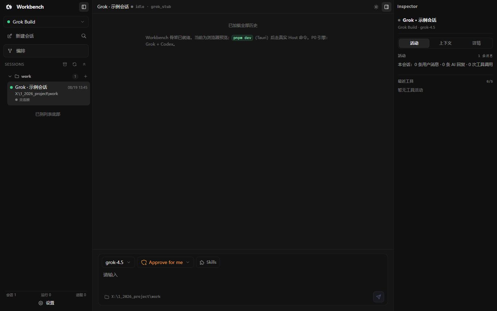
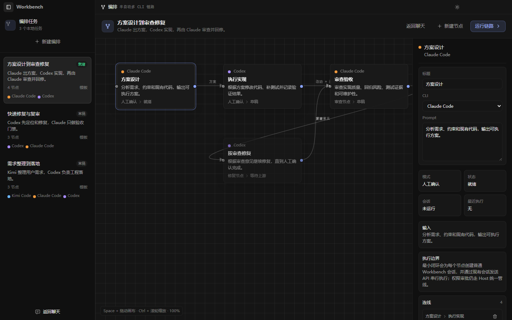
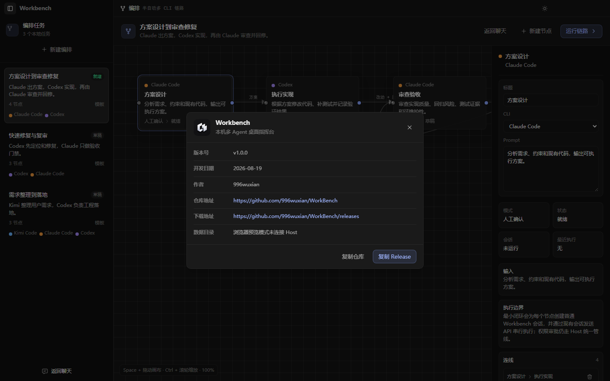
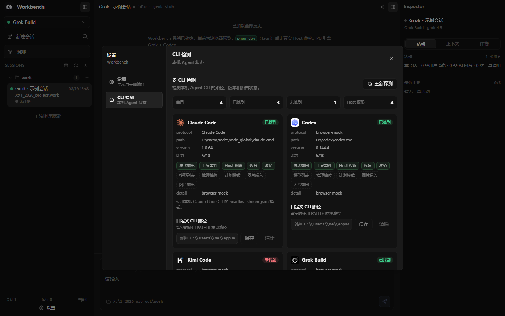

# Workbench

Workbench 是一款基于 **Tauri 2 + React 19 + TypeScript + Vite** 的本机多 Agent 桌面指挥台。它用统一的会话、权限、流式事件和桌面 UI 管理本机已经安装的 Agent CLI；Workbench 不重写各家 Agent 的模型能力，也不把 CLI、密钥或登录态打进安装包。

参考架构：`docs/MULTI-AGENT-WORKBENCH-方案.md`

## 首次启动加载


应用首次打开时先显示独立的静态 loading 页面，避免 React 和 Host 初始化过程中出现白屏。加载动画在 `index.html` 中直接渲染，React 启动后由 `src/main.tsx` 触发离场动画并移除。

## 多 Agent 会话工作台



三栏工作台把会话列表、聊天窗口和 Inspector 状态面板放在同一个桌面窗口里。每个会话绑定一个 runtime，支持按项目分组、置顶、归档、重命名、导出、同步原生会话和查看运行状态。

## 可视化编排



编排视图把多 CLI 协作拆成节点链路。当前内置“方案设计、执行实现、审查验收、按审查修复”等模板任务，每个节点仍然创建普通 Workbench 会话，权限审批和发送链路继续走 Host 统一管线。

## 应用信息与版本



点击左上角 Workbench 标题可以打开应用信息弹窗，查看当前版本、开发日期、作者、仓库地址、Release 地址和应用数据目录。版本号由 `package.json` 注入前端，并通过同步脚本同步到 Tauri 与 Rust crate。

## CLI 检测与设置



设置面板支持调整界面字号、查看本机 Agent CLI 探测结果、诊断 runtime 能力和覆盖 CLI 路径。Workbench 默认只读探测 PATH、常见安装位置和用户 override，不会写入用户的 Agent 全局配置目录。

## 功能亮点

- 多 runtime：已启用 Claude Code、Codex、Kimi Code 和 Grok Build。
- 统一会话：Workbench 维护本地会话镜像、消息 journal、snapshot 和 trace。
- 项目分组：会话按工作目录分组展示，打开一个项目时其它项目自动收起。
- 聊天输入：会话运行或对方正在回复时会禁用输入，避免重复提交。
- Codex 图片输入：Codex 会话支持粘贴图片、悬浮预览、气泡内展示、点击放大和右键复制大图。
- 权限审批：支持 `ask`、`auto`、`read_only`、`full_access` 等模式，具体选项由 runtime manifest 暴露。
- 原生会话同步：支持从各 Agent CLI 的原生会话数据恢复到 Workbench 列表。
- 会话导出：支持导出 Markdown 和 trace，便于复盘、排障和归档。
- 首屏 loading：使用和 doTime 一致的 `index.html` 静态 loading，React 启动后淡出。
- 版本同步：`pnpm sync:version` 会以 `package.json` 为来源同步 Tauri 和 Rust 版本字段。

## Runtime 支持

| Runtime | 接入方式 | 状态 | 说明 |
| --- | --- | --- | --- |
| Claude Code | `claude -p --output-format stream-json` | 已启用 | 支持本机 Claude 配置、会话恢复、MCP 权限审批桥 |
| Codex | `codex app-server --stdio` | 已启用 | 支持模型/推理档位、会话恢复、权限审批和图片输入 |
| Kimi Code | ACP | 已启用 | 依赖本机 CLI 与 ACP 可用性 |
| Grok Build | ACP: `grok agent stdio` | 已启用 | 支持流式消息、工具事件和 Host 权限门 |

## 架构

```text
React UI
  -> Tauri commands
    -> SessionManager + Session FSM
      -> Runtime Registry
        -> ACP adapters
        -> Codex App Server adapter
        -> Claude stream-json adapter
```

| 路径 | 职责 |
| --- | --- |
| `src/` | React UI、会话切换、聊天渲染、权限条、运行状态面板 |
| `src-tauri/src/session_fsm.rs` | Host 独占状态机 |
| `src-tauri/src/session_manager.rs` | 会话生命周期、事件转发、消息 journal |
| `src-tauri/src/runtime/` | Runtime trait、registry、各 CLI adapter |
| `src-tauri/src/host/events.rs` | UI 消费的统一 HostEvent |
| `src-tauri/runtimes/builtin.json` | 内置 runtime manifest |
| `src-tauri/src/runtime/claude_permission_bridge.mjs` | Claude Code 权限审批 MCP bridge |

## 数据说明

Workbench 默认不提交、不打包、不写入用户的 Agent 登录态或 API Key。

- App 数据目录：Windows `%APPDATA%\workbench\Workbench`
- 会话镜像：`sessions/`
- 会话图片：保存到对应会话目录，删除会话时随会话数据清理
- 会话 trace：`sessions/<session-id>/trace.jsonl`，右键可导出到 `exports/*.trace.jsonl`
- 隔离 Agent home fallback：`agent-homes/`
- 日志：`logs/`
- Claude 权限桥临时配置：系统 temp 下的 `workbench-claude-mcp/`

trace 默认只记录时间、状态、耗时、字节数、工具名和错误码，不记录对话正文、权限 preview、工具命令或敏感路径。发布前仍建议执行一次密钥扫描。

## 开发

```powershell
cd X:\1_2026_project\work

# 推荐桌面开发
.\scripts\dev.ps1

# 仅前端预览
pnpm dev:ui
```

常用验证命令：

```powershell
pnpm typecheck
pnpm build:ui

. .\scripts\dev-env.ps1
cd src-tauri
cargo check
```

## 版本同步

版本号以 `package.json` 为单一来源：

```powershell
pnpm sync:version
```

脚本会同步：

- `src-tauri/tauri.conf.json`
- `src-tauri/Cargo.toml`
- `pnpm-lock.yaml` 中可识别的 root importer version

`vite.config.ts` 会把 `package.json` 版本注入为 `__APP_VERSION__`，应用信息弹窗直接显示该版本。

## 构建

```powershell
pnpm tauri build
```

调试打包但跳过 installer：

```powershell
pnpm tauri build --debug --no-bundle
```

图标来自 `public/logo.png`。如需重新生成 Windows 任务栏、EXE、installer 图标：

```powershell
pnpm tauri icon public\logo.png
```

该命令会覆盖 `src-tauri/icons/` 下的 PNG/ICO/ICNS/Appx/iOS/Android 图标生成物，执行前需要确认。

## 发布前检查

```powershell
pnpm typecheck
pnpm build:ui
. .\scripts\dev-env.ps1
cd src-tauri
cargo check
```

建议发布前安装构建产物，验证 Claude/Codex/Kimi/Grok 至少各一条消息，并分别检查权限模式、原生会话同步、删除会话和 Codex 图片输入。

## 技术栈

| 层 | 技术 |
| --- | --- |
| 桌面壳 | Tauri 2 + Rust |
| 前端 | React 19 + TypeScript + Vite |
| 样式 | Tailwind 4 + 项目 CSS tokens |
| 图标 | Tabler Icons |
| Runtime | ACP、Codex App Server、Claude stream-json |
| 测试 | Vitest、TypeScript typecheck、Cargo check |

## License

MIT. See `LICENSE`.
